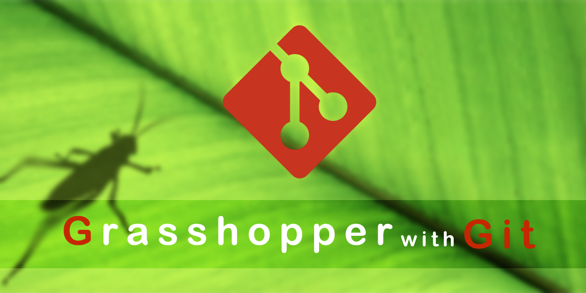

# GGit
> Git integration for Grasshopper user, no need to install git

This plugin can make grasshopper get version control super power right away

## Installation

Documents comes later...

## Usage example

Documents comes later...

## Development setup

Documents comes later...

## Release History

* 0.0.1
    * Work in progress

## Meta

KaivnD – KaivnD@hotmail.com

Distributed under the MIT license. See ``LICENSE`` for more information.

[https://github.com/KaivnD/GGit.git](https://github.com/dbader/)

## Contributing

1. Fork it
2. Create your feature branch (`git checkout -b feature/fooBar`)
3. Commit your changes (`git commit -am 'Add some fooBar'`)
4. Push to the branch (`git push origin feature/fooBar`)
5. Create a new Pull Request

## Credit

1. [Grasshopper](https://www.grasshopper3d.com/), which is a wonderful tools for visual programming.
2. [LibGit2Sharp](https://github.com/libgit2/libgit2sharp), with out their work, this wouldn't exist.
3. [ObjectListView](https://github.com/drxaero/ObjectListView), provide a very nice list view component for winform, that's awesome by the way.
